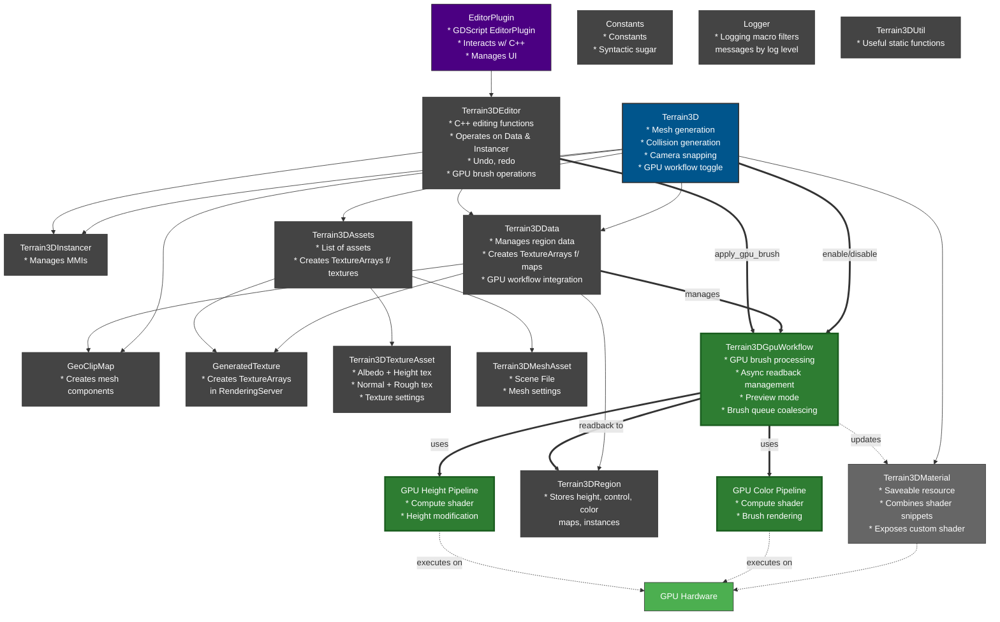
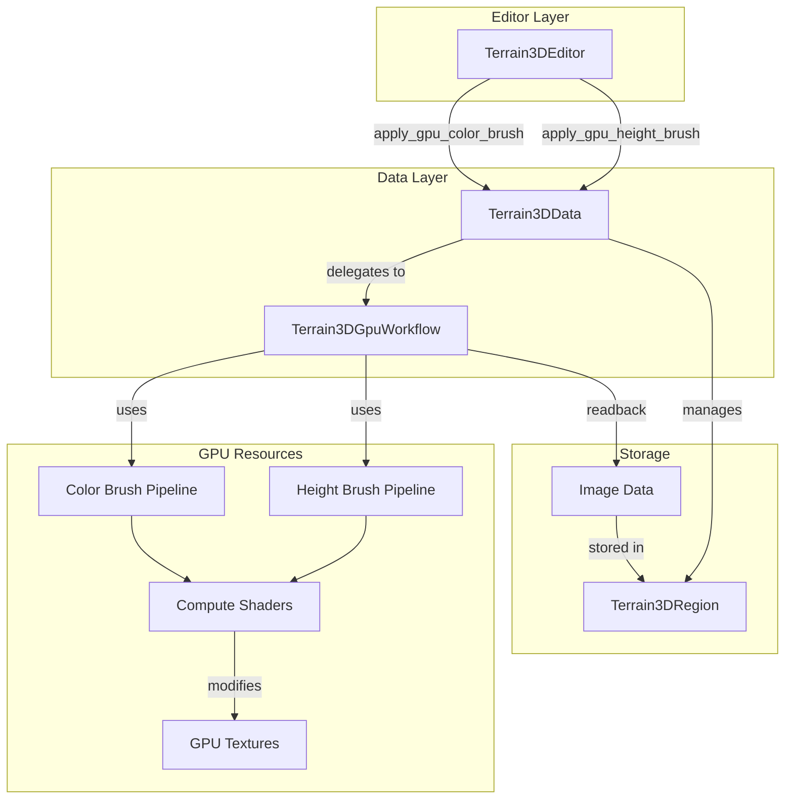
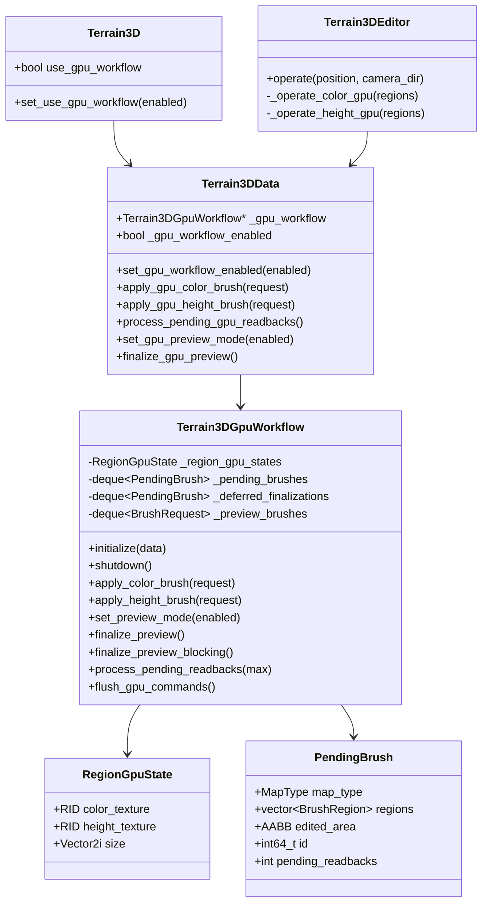
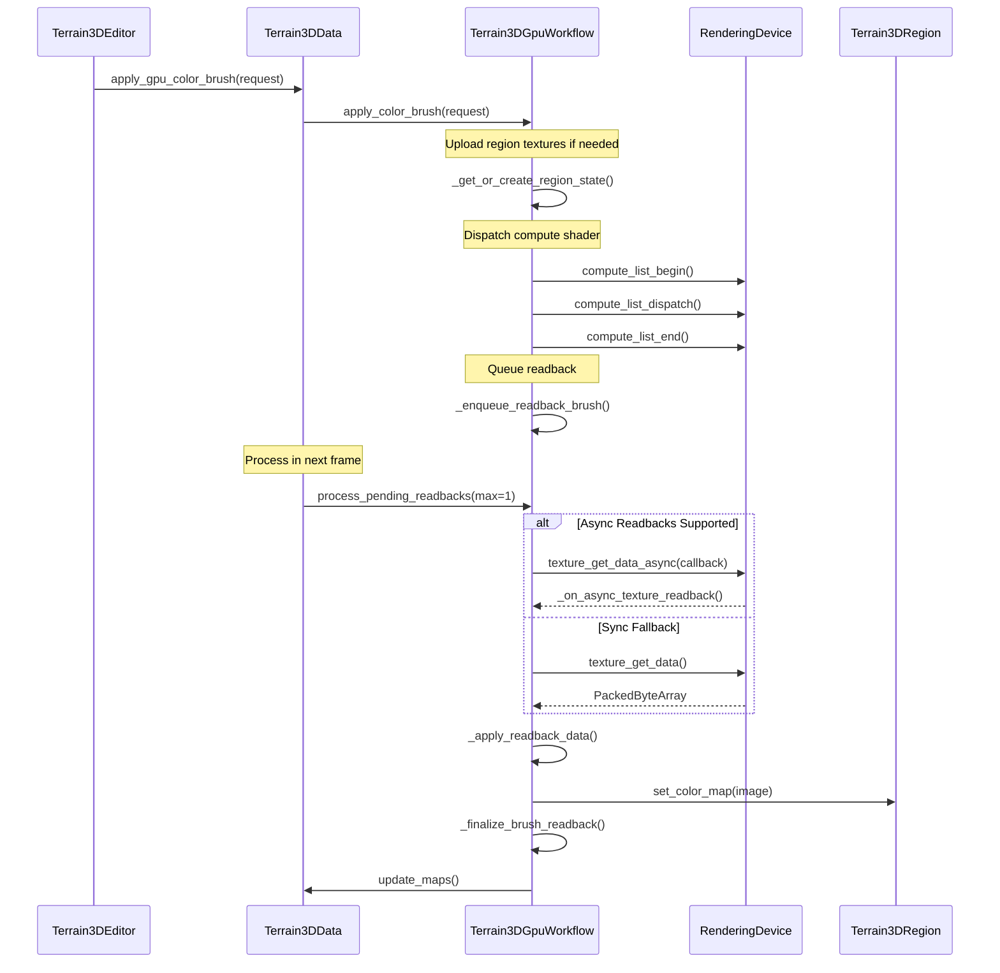
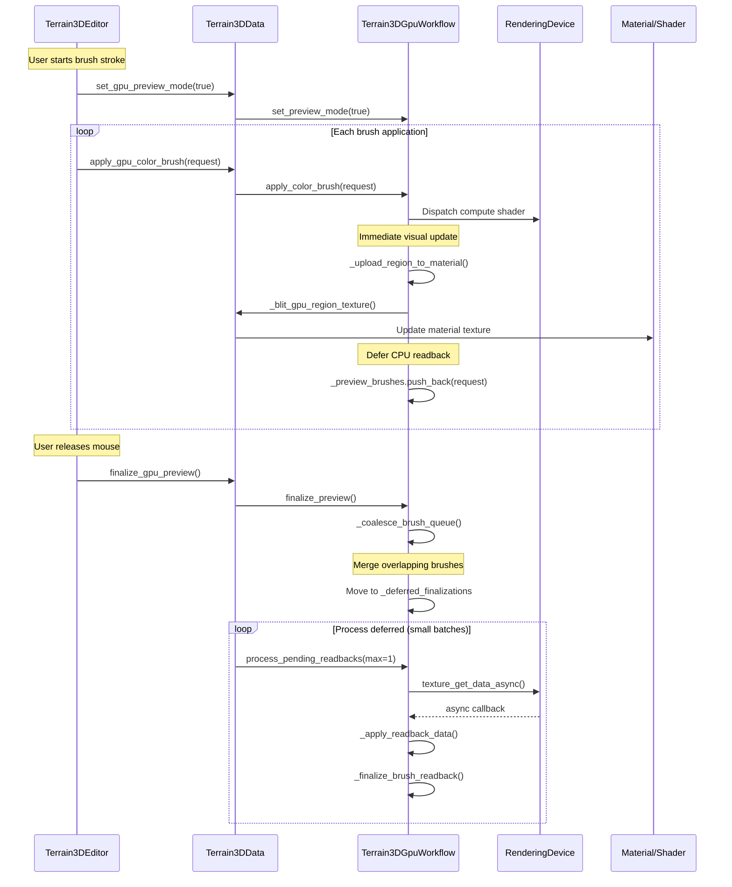
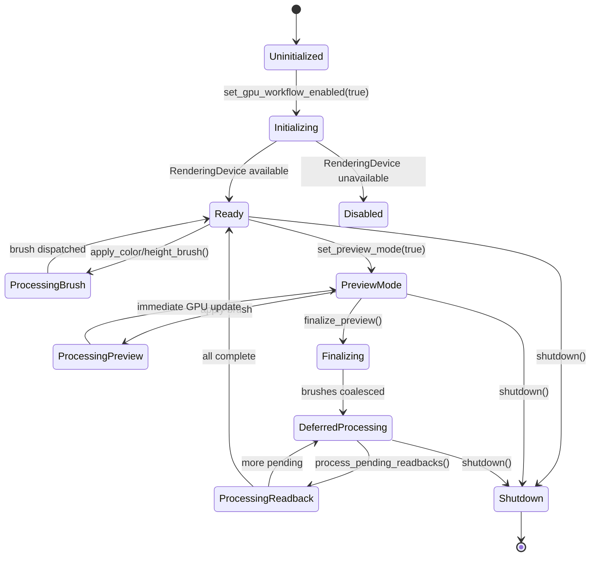
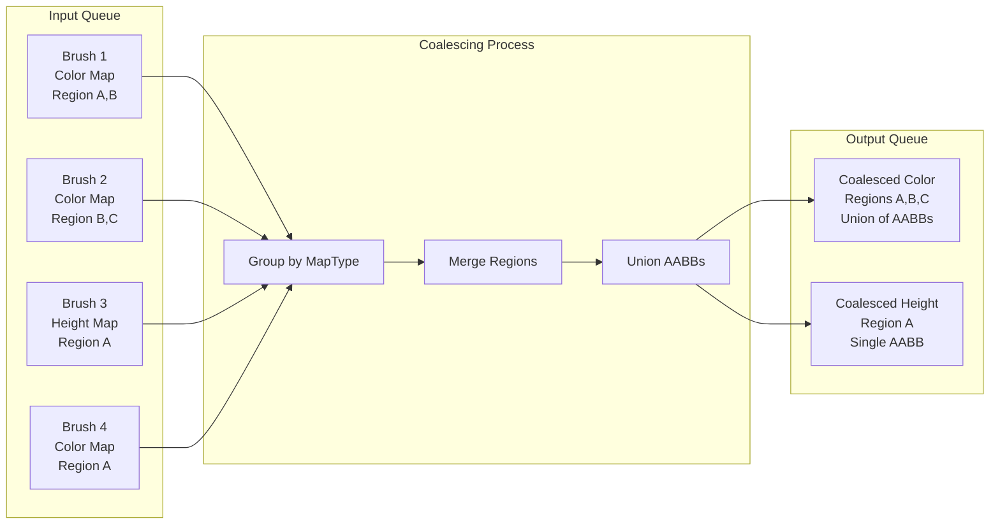
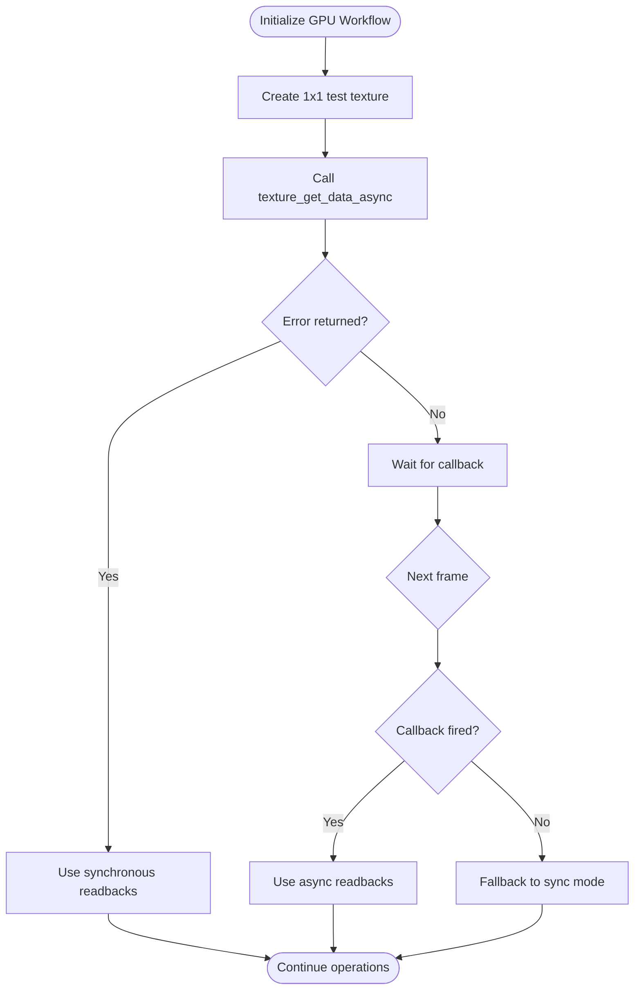
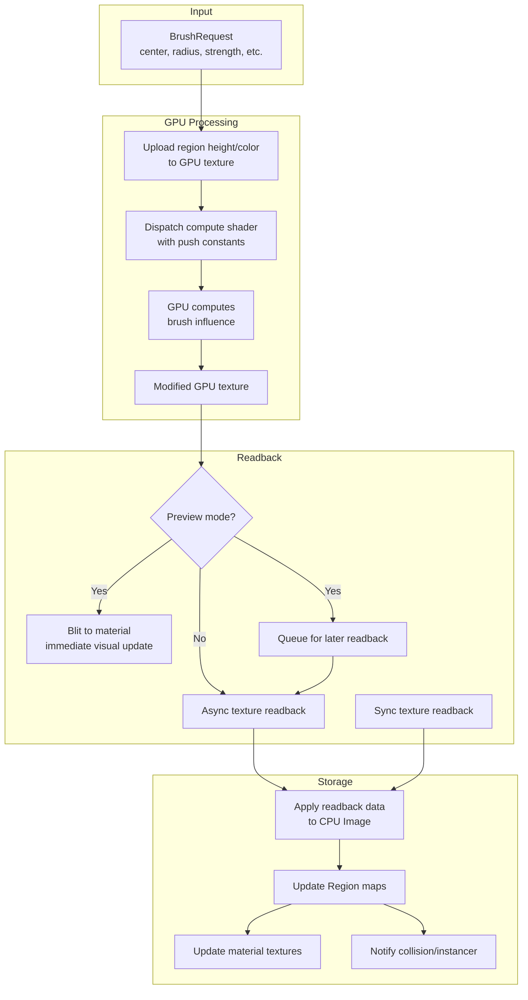

# GPU Workflow Architecture

This document describes the GPU-accelerated brush workflow architecture introduced to optimize terrain editing performance.

## Overview

The GPU workflow moves terrain brush operations from CPU to GPU, enabling:
- Real-time preview of brush strokes without CPU readbacks
- Asynchronous GPU→CPU data transfer
- Batch processing of brush strokes to reduce overhead
- Improved performance for large terrain edits

## System Architecture with GPU Workflow Changes

This diagram shows the complete Terrain3D architecture with the **new GPU workflow components highlighted in green**. Components and connections shown in standard colors were part of the original architecture.



**Key Changes:**
- **Terrain3DGpuWorkflow** (new): Core GPU workflow manager that handles brush processing on GPU
- **GPU Pipelines** (new): Compute shader pipelines for color and height brush operations
- **Terrain3DData integration**: Now manages GPU workflow lifecycle
- **Terrain3DEditor integration**: Calls GPU brush operations when workflow is enabled
- **Direct GPU execution**: Brush operations execute as compute shaders on GPU hardware
- **Async readback**: Modified textures are read back to CPU asynchronously

## Detailed System Architecture



## GPU Workflow Component Diagram



## Brush Processing Workflow

### Standard (Non-Preview) Mode



### Preview Mode Workflow



## GPU State Management



## Brush Queue Coalescing

The GPU workflow includes a brush coalescing mechanism to optimize performance by merging multiple brush operations on the same regions.



## Async Readback Detection

The system automatically detects whether the rendering backend supports asynchronous texture readbacks.



## Data Flow: GPU Brush to Region Storage



## Key Features

### 1. Deferred CPU Readbacks (Preview Mode)
- GPU updates material textures immediately for visual feedback
- CPU readbacks deferred until brush stroke ends
- Prevents frame drops during interactive editing

### 2. Brush Coalescing
- Multiple brush strokes merged by map type
- Reduces number of GPU→CPU transfers
- Minimizes redundant processing

### 3. Async Readback Support
- Automatically detects backend capabilities
- Falls back to synchronous mode if needed
- Non-blocking texture transfers when supported

### 4. Incremental Processing
- Processes readbacks in small batches per frame
- Configurable `max_brushes` limit
- Prevents UI freezing on large edits

### 5. Region-Based GPU State
- Per-region GPU texture cache
- Textures created on-demand
- Automatic cleanup on region removal

## Performance Characteristics

| Operation | CPU Workflow | GPU Workflow (Standard) | GPU Workflow (Preview) |
|-----------|--------------|------------------------|------------------------|
| Brush dispatch | Immediate CPU processing | GPU compute dispatch | GPU compute dispatch |
| Visual update | Immediate | After readback (~1 frame) | Immediate (GPU blit) |
| CPU readback | N/A | Every brush | End of stroke (batched) |
| Frame impact | High (large brushes) | Low-Medium | Very Low |
| Best for | Small edits | General use | Interactive painting |

## Configuration

### Enable GPU Workflow
```gdscript
# In Terrain3D node
terrain.use_gpu_workflow = true
```

### Adjust Readback Batch Size
The `_gpu_readbacks_per_flush` parameter in Terrain3DData controls how many brushes are processed per frame during finalization. Lower values spread work over more frames (smoother but slower), higher values complete faster but may cause frame drops.

## Implementation Files

- **src/terrain_3d_gpu.h/cpp**: Core GPU workflow implementation
- **src/terrain_3d_data.h/cpp**: Integration with data layer
- **src/terrain_3d_editor.h/cpp**: Editor-side brush operations
- **src/shaders/terrain_gpu_brush.glsl**: Color brush compute shader
- **src/shaders/terrain_gpu_height_brush.glsl**: Height brush compute shader