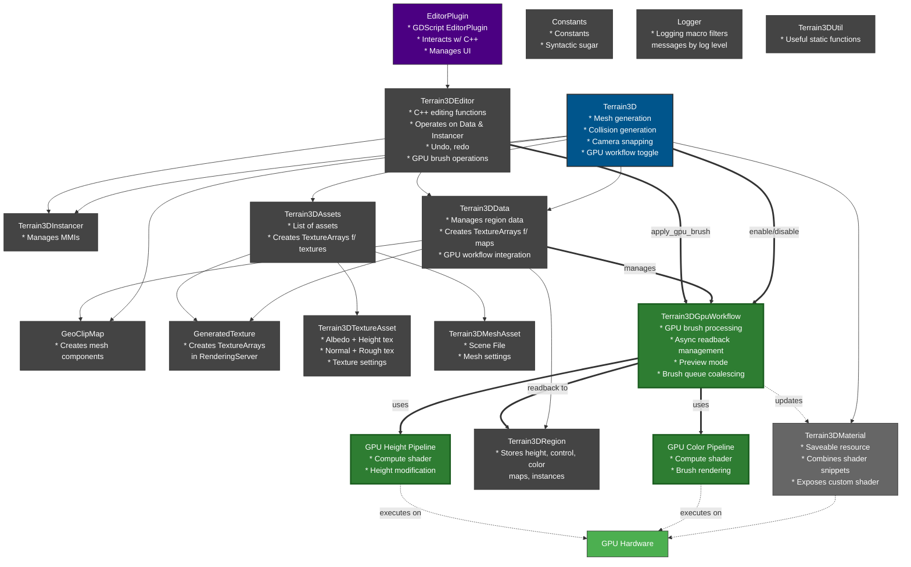
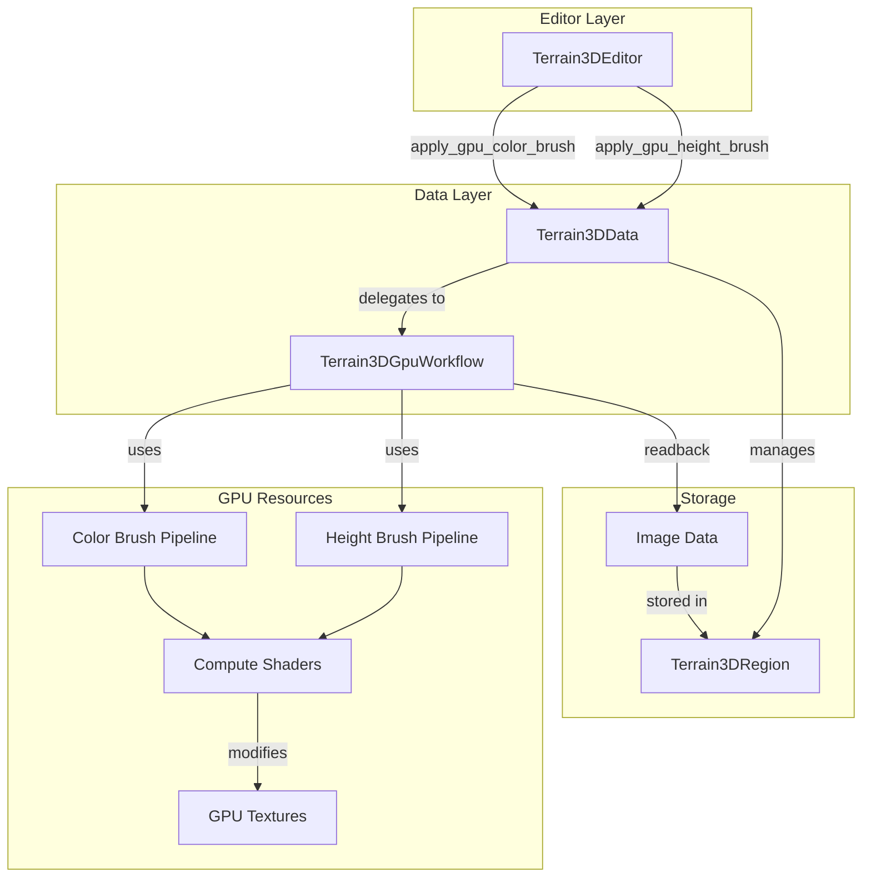

# GPU Workflow Architecture

This document describes the GPU-accelerated brush workflow architecture introduced to optimize terrain editing performance.

## Overview

The GPU workflow moves terrain brush operations from CPU to GPU, enabling:
- Real-time preview of brush strokes without CPU readbacks
- Asynchronous GPU→CPU data transfer
- Batch processing of brush strokes to reduce overhead
- Improved performance for large terrain edits

## System Architecture with GPU Workflow Changes

This diagram shows the complete Terrain3D architecture with the **new GPU workflow components highlighted in green**. Components and connections shown in standard colors were part of the original architecture.

**Key Changes:**
- **Terrain3DGpuWorkflow** (new): Core GPU workflow manager that handles brush processing on GPU
- **GPU Pipelines** (new): Compute shader pipelines for color and height brush operations
- **Terrain3DData integration**: Now manages GPU workflow lifecycle
- **Terrain3DEditor integration**: Calls GPU brush operations when workflow is enabled
- **Direct GPU execution**: Brush operations execute as compute shaders on GPU hardware
- **Async readback**: Modified textures are read back to CPU asynchronously

## Detailed System Architecture

